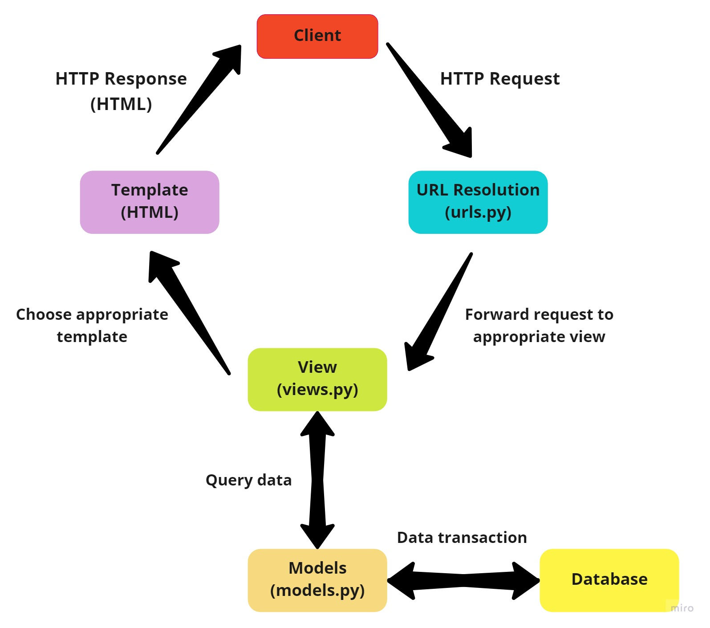

# Proyek Django PBP

Pemrograman Berbasis Platform (CSGE602022) - diselenggarakan oleh Fakultas Ilmu Komputer Universitas Indonesia, Semester Ganjil 2022/2023

Nama: Fadhlan Hasyim

NPM: 2106652215

Kelas: PBP F

Kode Asdos: BYN

## Pendahuluan

Repositori ini digunakan sebagai wadah untuk mengumpulkan tugas Proyek Django PBP.

## Link Deployment

Aplikasi Heroku yang sudah di-_deploy_ dapat diakses melalui link berikut:
[https://pbp-django-assignments.herokuapp.com/](https://pbp-django-assignments.herokuapp.com/)

## Jawaban Pertanyaan

### Pertanyaan 1: Buatlah bagan yang berisi _request client_ ke web aplikasi berbasis Django beserta responnya dan jelaskan pada bagan tersebut kaitan antara `urls.py`, `views.py`, `models.py`, dan berkas `html`

**Jawab:**



Setiap _request_ yang masuk akan diproses oleh `urls.py` dan akan diteruskan ke `views.py` yang sesuai. Jika _request_ berhubungan dengan data, maka `views.py` akan melakukan _query_ ke `models.py` dan _database_. Hasil _query_ akan dikembalikan lagi ke `views.py`. Setelah itu, hasil yang sudah diperoleh akan dikembalikan lagi ke _client_ dalam bentuk `HTML` sebagai _response_.

### Pertanyaan 2: Jelaskan kenapa menggunakan _virtual environment_? Apakah kita tetap dapat membuat aplikasi web berbasis Django tanpa menggunakan _virtual environment_?

**Jawab:**

Jawaban untuk pertanyaan kedua adalah bisa. Namun, terdapat beberapa kekurangan jika kita tidak menggunakan _virtual environment_. Berikut adalah kekurangan-kekurangan tersebut:
- Sistem operasi Linux dan masOS hadir dengan Python versi tertentu yang digunakan untuk menjalankan _internal tasks_ pada sistem operasi tersebut. Jika kita tidak menggunakan _virtual environment_ pada proyek Django yang sedang kita kerjakan, hal ini dapat mengganggu kinerja sistem operasi tersebut karena bisa saja kita meng-_install_ versi _packages_ yang berbeda sehingga dapat meng-_override_ _packages_ versi lama yang sudah ada. Tentu akan sangat berbahaya jika versi terbaru _packages_ tersebut tidak sesuai dengan kebutuhan yang diperlukan oleh sistem operasi.
- Proyek yang berbeda bisa saja menggunakan _packages_ yang sama dengan versi yang berbeda. Tanpa menggunakan _virtual environment_, _packages_ akan di-_install_ secara global. Hal ini akan mengakibatkan saling tindih antar _packages_ yang sama dengan versi yang berbeda sehingga berdampak kepada proyek-proyek yang ada.
- Akan sulit bagi kita untuk mengetahui apa saja _requirements_ dari suatu proyek jika kita tidak menggunakan _virtual environment_ karena seluruh _packages_ yang digunakan oleh seluruh proyek yang ada akan disimpan di suatu tempat yang sama (`site-packages/`).

Berkaca dari kekurangan-kekurangan di atas, dengan menggunakan _virtual environment_, kita seolah-olah memisahkan pengaturan dan _packages_ dari satu proyek Django dengan sistem operasi dan proyek Django lainnya dengan menciptakan lingkungan virtual sendiri. Oleh karena itu, perubahan yang terjadi pada satu proyek, tidak akan memengaruhi sistem operasi maupun proyek lainnya.

### Pertanyaan 3: Jelaskan bagaimana cara kamu mengimplementasikan poin 1 sampai dengan 4 di atas.
 
**Jawab:**

Hal pertama yang saya lakukan adalah membuat repository dari template yang sudah disediakan. Setelah itu, meng-cloning repository tersebut ke lokal. 

Untuk poin 1, saya membuat fungsi `show_katalog` pada `views.py` di mana fungsi tersebut menerima satu buah parameter berupa request dan mengembalikan hasil render yang di-assign kepada template `katalog.html`. Fungsi `show_katalog` juga mengambil data katalog dari model `CatalogItem`.
```
def show_katalog(request):
    data_item_katalog = CatalogItem.objects.all()
    context = {
        'data_item_katalog': data_item_katalog,
        'nama': 'Fadhlan Hasyim',
        'id': '2106652215',
    }
    return render(request, 'katalog.html', context)
```
Untuk poin 2, saya mendaftarkan fungsi `show_katalog` pada `urls.py` sehingga ketika ada _request_ yang masuk dapat diarahkan ke _views_ yang tepat.
```
...
urlpatterns = [
    path('', show_katalog, name='katalog')
]
...
```
Untuk poin 3, saya memetakan data yang diperoleh dari _views_ ke dalam templat HTML menggunakan sintaks Django. Untuk kode lengkapnya dapat diakses di sini [katalog.html](katalog/templates/katalog.html).
    
Untuk poin 4, saya membuat aplikasi Heroku, lalu mendaftarkan HEROKU_API_KEY dan HEROKU_APP_NAME sebagai secrets. _Last but not least_, saya menjalankan kembali GitHub Actions yang gagal dan _voila_! _deployment_ berhasil.
